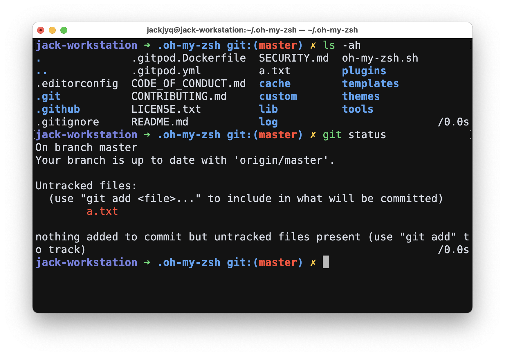

# robbyrussell-plus-zsh-theme

The [robbyrussell theme](https://github.com/ohmyzsh/ohmyzsh/blob/master/themes/robbyrussell.zsh-theme) plus hostname.



## Installation

### Step 1: Run the following command

```bash
curl "https://raw.githubusercontent.com/jackjyq/robbyrussell-plus-zsh-theme/main/robbyrussell-plus.zsh-theme" --output "${ZSH_CUSTOM:-~/.oh-my-zsh/custom}/themes/robbyrussell-plus.zsh-theme"
```

### Step 2: Edit your `~/.zshrc` file

```zsh
ZSH_THEME="robbyrussell-plus"
```


## Acknowledgement

Based on [robbyrussell.zsh-theme](https://github.com/ohmyzsh/ohmyzsh/blob/master/themes/robbyrussell.zsh-theme)

## License

MIT